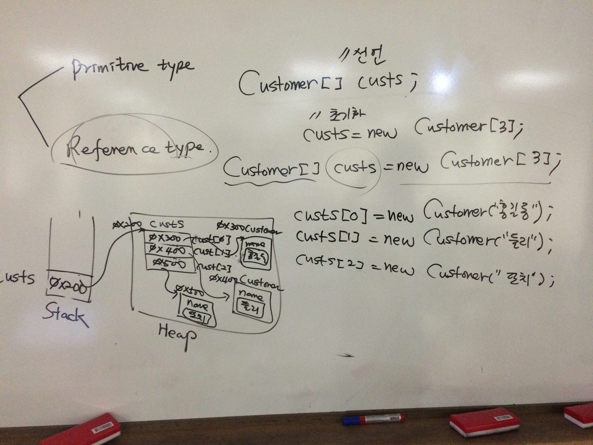

**[날짜 선택화면](../README.md)**

##Java

- JavaSE
  - core, jdbc, SQL
- JavaEE
  - Servlet/JSP

웹 어플리케이션 만든다 하면 -> dynamic web page를  구성되어 있는 어플리케이션

dynamic <-> static

예전엔 static 페이지만 웹에서 가능했지만 단순 html만 써서 만드는게 static

회원가입 페이지를 한 사람을 위한 페이지를 하나하나 다 만들어야 한다고 생각하면

동적으로 다이나믹하게 DB와 연동

dynamic하게 할수 있는게 servlet/jsp,php,asp.NET(MS) 기술이 있다.

사용자로부터 받은 정보를 DB로 저장하고 따로따로 관리할수 있는게 웹 어플리케이션이라 한다.

##UI와 관련된 기술

- html(화면)
- css(디자인)
- javascript(jquery)(버튼을 클릭했을때 이벤트, 사용자와의 동적인 커뮤니케이션)
가변적으로 테이블 로우수 늘려주고 줄여주는 것을 표현하고 싶을때 
- node.js 서버 역할

##opensource framework 제공

개발자가 순수하게 개발하게 힘들고 고민하는 것을 라이브러리 형태로 제공

- mybatis
- spring
- jUnit

사용자 browser -요청-> WAS(Web App Server) tomcat, 배포하는 War(Web Archive) - DB Server

Web Application Architecture

논리적으로 역할 분리

##각 계층 정리

web browser -요청-> 

Client 계층 | Presentation 계층 | Service 계층 | Data Access 계층 | DAO
------------|-------------------|--------------|------------------|--------

- DAO 에서 db CRUD SQL 작업한 DB 있음, xml 파일 저장
- Data Access 에서 DB연동은 jdbc사용 or mybatis , xml 파싱코드 사용
- Service 계층(biz로직)
- Presentation 계층 servlet - jsp 에서 자바를 불러올수 있음.
- Client 계층 html,css,js(jquery)

- html은 biz로직 포함하는 data Access 계층을 접근할수 없음.
- 중간에 jsp/servlet이 접근하게 도와줌.
- servlet(java에 html 코드 포함, java가 메인, html 코드사용해서 페이지 구성할수 있다.)
- 사실 servlet에 html 코드 작성하면 수정시 다시 컴파일해서 배포해야 하는 문제 발생
- servlet은 요청 넘겨주고 결과 넘겨주는 중간역할이 servlet이다.

##mvc 패턴 - Model2Architecture 이다.

- model - java

- view - html,jsp

- controller - servlet

중재자 역할 servlet, 자바쪽에서 넘겨준 데이터 사용은 jsp

- spring framework은 presentation, service계층, data Access 계층에 두루두루 사용됨.

- mybatis는 data access 계층에서만 사용함.

아키텍처를 다 설계 해줄테니 개발자는 화면ui나 biz로직을 생각해라.

##그 외

- 테이블 안의 DB 읽고 쓰는것, xml 데이터 받아 파싱한다던지 JDBC,XML

- JDBC라는 API를 쓰거나 편하게 개발할수 있는 MYBATIS 쓴다.

- jsp안에서 DB연동 소스 넣고 만들수있지만 복잡해지고 유지보수의 어려움생김.

- UserDAO 클래스에 DB연동하는 코드만 작성해라 

- Service 계층 Biz 로직 
업무별로 복잡한 로직있음.(주식, 금리, 환율)

---------------------------------------------------------------------------------------------------------

##프로젝트 zip 파일 import 해서 추가하기

import -> import -> general -> exisiting projects into workspace -> select archive file(zip 파일 선택) -> finish

##예외

- checked exception - IOexception(try catch로 반드시 예외처리해야함), SQLException
- runtimeexception 

##object

source -> generate constructor using fields 생성자 사용
source -> generate getter setter 게터 세터 생성

toggle block selection mode(alt + shift + a) 커서 여러개 선택하고 싶을때 사용

source -> override/implement methods

메서드 선언만 같이 

Customer cust1 = new Customer("홍길동"); 스택에 cust1의 null이 쌓이고 힙에 0x100의 customer 공간이 만들어짐
customer 안에 name 속성 홍길동 들어감.

string은 레퍼런스 타입이어 힙 안에 객체가 2개가 생성

----------------------------------------------------------------------------------------

##jUnit

[junit4 api doc](http://junit.sourceforge.net/javadoc/)

[junit 문서 보기](../resources/JUnit.pdf)

프로젝트 선택후 build path -> configure build path -> library -> add library -> jUnit

static import 라는게 있다.

'Assert'.asserEqual(), 'Assert'.assertSame()

클래스명 계속 부르는 문제 발생

**import static org.junit.Assert.assertEqual;** 이렇게 쓰면 클래스명 생략 가능하다.
**import static org.junit.Assert.assertSame;**

매번 쓰기 귀찮으므로 **import static org.junit.Assert.*;**

assertEqual(), assertSame()로 클래스 없이 호출

-----------------------------------------------------------------------------------------

##배열

- primitive type(기본형)

int[] nums; // 선언
nums = new int[3]; // 초기화

int[] nums = new int[3]; // 선언 및 초기화

stack heap

스택에 nums라는 방이 생김
레퍼런스타입은 클래스, 인터페이스, 배열, enumeration 

heap 영역에 allocation 생김 int nums[3] 타입의 3개 생기고 기본값이 0 인 방이 3개 만들어짐.
nums[0] = 10;, nums[1] = 20;, nums[2] = 30; 을 선언하면 heap 영역에 차례대로 저장됨.

##객체를 참조하는 배열

- reference type

Customer[] custs; // 선언
custs = new Customer[3]; // 초기화

Customer[] custs = new Customer[3]; // 선언 및 초기화

custs는 배열타입이므로 초기값 null로 스택에 저장, 다음 new를 만나니깐 heap 영역에 custs 객체영역 생성 custs[0], custs[1], custs[2], 0x10 주소 할당
custs[0] = custmoer 타입

custs[0] = new Customer("홍길동");
custs[1] = new Customer("둘리");
custs[2] = new Customer("또치");

customer 객체 생성되고 name이 둘리 생성 다음 배열에 주소가 들어가게 됨. 

source -> generate tostring()
for ctrl+space bar iterate over array

##로직 메소드로 빼기

refactor -> extract method -> 메소드로 나옴.

- 기호는 private 
private string name;
generate constructor using filed

------------------------------------------------------------------------------------------------------

### :key: 정리

1. jUnit
2. primitive reference type
3. statck, heap,
4. equals 메서드 오버라이딩하는 소스 작성
5. @Test @Ignore @Before
6. customer type 형태의 array 만듬.
