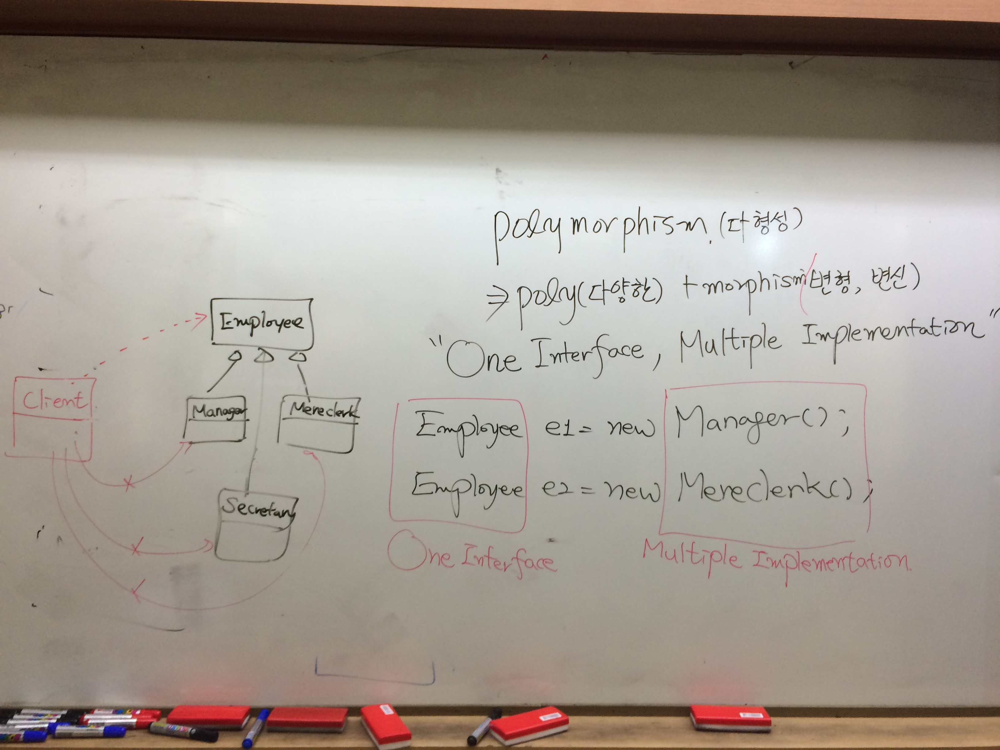
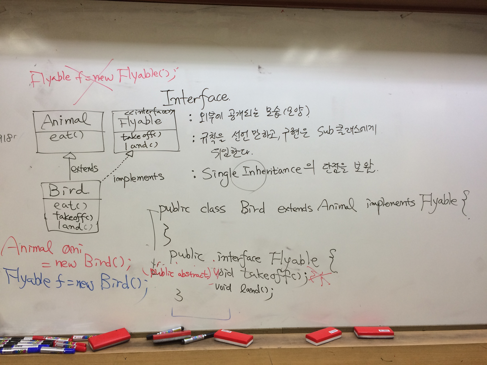

**[날짜 선택화면](../README.md)**

##enum

열거
public enum 클래스이름{}
public enum week{MONDAY,TUESDAY,WEDNESDAY,THURSDAY,FRIDAY}

run configurations -> Arguments 탭 -> Program arguments MONDAY 입력

##OOP
속성과 동작, 필드와 메서드

[!uml](../resources/uml.JPG)

- 집합관계(Aggregation) : 자동차 구성요소 - 엔진, 타이어, 핸들
1:N 관계 자동차1 N개의 객체 정보

- 사용관계(Association) : 사람이라는 객체
1:1 관계

- 상속관계(Inheritance)

## UML(unified Modeling Language)

Hotel클래스 Room 클래스
호텔안에 룸이 여러개 있으면 1:N

- 네모박스 클래스, 선은 association 관계

- N은 다이아몬드 표시함.

- Room 배열 Rood[] rooms, List<Room> rooms (컬렉션 타입 저장)

사용관계
Reservation 클래스가 룸정보를 참조한다고 하면 association 

상속관계 

employee <- Manager
<- Mere clerk

- 상속, 다형성, 캡슐화

메서드나 변수 외부에서 접근못하게 막음.

##클래스 구성멤버

1. 필드
2. 생성자
3. 메소드

- 생성자의 역할은 인스턴스 변수 초기화, 객체를 생성될때 불려짐.

- 생성자 오버로딩 : 파라미터 아규먼트 갯수 다르게 받는것 

- 메서드 오버로딩 : 매개변수 타입 개수 순서가 다른것.

------------------------------------------------------

##멤버변수

1. Instance Variable(=non static) : 객체 생성시 고유한 값을 갖는 변수 , 바로 접근 못하고 반드시 객체 생성하고 접근해야함.

언제 초기화 할것인가?

2. Static Variable(=class) : 클래스에 속한 변수

왜 static붙이고 안붙이나?

카드를 만든다고 생각하자.

- card 종류별로 객체만들면 다름.

- suit: int
- width, height는 카드객체 생성될때 width, height 값이 같음.
- 그러므로 굳이 Instance Variable로 갈 필요가 없다.
- 굳이 힙영역에 각각 메모리 공간 만들어서 suit라는 방에 메모리 낭비할 필요없다.

  - suit: int
  - static height: int
  - static width: int

this
static{ // stati initializer

}

##싱글톤

- 싱글톤 형태로 쓰는이유 : 매번 메모리 힙에 객체가 썻다 지웠다 문제발생
- 객체를 단 하나만 생성되게함.
- 디자인패턴 - 구현하기전 클래스 설계할 때 개발자들에게 가이드를 줌.
- 패턴을 학습해야하는 단점이 있지만, 가이드라인을 주면 적용함
- 객체를 생성후 계속 재사용하고 싶을때 싱글톤을 사용함.

생성 패턴(creational pattern) 
구조 패턴(structural pattern)
행위 패턴(behavior pattern)

## 단축키

- 주석 ctrl+shift+/, ctrl+/
- 주석 풀기 ctrl+shift+\
- ctrl+shift+f

## final 상수

선언과 동시에 초기화 할수있고, 선언만 해놓고 초기화는 생성자에서 할수 있음.
생성자에서 값을 초기화 시켜놨음.
컴파일 오류 발생

## 패키지, import

패키지란 파일관리 위해 사용하는 폴더 

import 디렉토리 별로 분류

public(+) > protected(#)(Same package + Subclassing) > default(~)(Same package)> private(-)(Same Class)
	   		

+,#,~,- 기호이다.

패키지가 달라도 상속관계이면 접근되는것이 protected

**각 접근제한자를 붙일수 있는것.**

1. public - class, constructor, method, field

2. protected - field,method,constructor

3. default - class, field, method, constructor ex) class car

4. private - field, method, constructor

## 상속

**상속을 쉽게 하는 방법**

.java 파일 클릭후 -> refactor -> extract superclass -> superclass name

-> add -> MereClerk - company -> name,salary,getname(),getsalary()

employee 클래스의 부모는 object클래스다.
super(); 오브젝트 생성자 콜하는 것.
얘 부모 상위 클래스 즉 오브젝트 생성자 호출하는 문장임.

생성자 오버로딩

## 클래스 상속

단일상속 해결위해 인터페이스 사용

부모 생성자 호출 할때 super(매개변수) 매개값, 통일한 타입, 개수, 순서 맞춰야함.

## 오버라이드

abstract 추상메서드 만드는 이유는 바디(블록) 없고 선언만 되어있는 메서드 

추상메서드 만들면 추상클래스 선언해줘야함.

## 다형성

polymorphism(다형성)
-> poly(다양한) + morphism(변형, 변신)

"one interface , multiple implementation"

원 타입 = 구현은 다양하게
Employee e1 = new Manager();
Employee e2 = new Mereclerk();

one interface , multiple implementation

Employee

6,7,8

publication 만들고
magazine 

레퍼런스북
super class를 company.publication 로 하고 construction from superclass 체크 들어간다.

publication에 출판과 관련된 제목 페이지수 

magazine월간지냐 주간지냐

규약을 만들었음.

ms-sql
was 

novel 저자 누구냐
레퍼런스북은 어떤분야 레퍼런스북

##인터페이스

jdbc 인터페이스  오라클(db벤더 (객체)), mysql 가 

개발코드 변경없이 실행환경 다르게 할수있다.
개발자는 인터페이스만 보고 코딩함.

Interface : 외부에 공개되는 모습(모양)
인터페이스가 안좋아 -> 보여지는 모습
: 규칙을 선언만하고 구현은 sub클래스에게 위임한다.
: SingleInheritance의 단점을 보완

Animal
eat()
↑extends
Bird
eat() → implements <<interface>> flyable

여러가지 기능을 계속 implements는 여러번 가능

인터페이스에 있는 기능 쓰려면 반드시 오버라이딩 해야함

public class birds extends Animal implements Flyable{
 
}
public interface flyable{
 (public abstract)void takeoff();
  		  void land();
}

Animal ani = new Bird(); (o)
Flyable f = new Flyable(); (x) 추상보다 더 추상이므로 
Flyable f = new Bird(); (o)

실습 : new -> interface

추상은 이탤릭체

bird클래스 생성시 superclass chap08.animal, interface chap08.flyable 추가

다른점
추상클래스는 바디가 있는 메서드 콘크리트 추가로 추상메서드 가질수 있다.
인터페이스는 추상메서드만 가질수 있다.

공통점
추상클래스와 인터페이스 공통점은 자기 자신이 스스로 객체 생성 불가
반드시 하위클래스 통해서 객체 생성해야 한다.

생성자를 상위클래스에서 추가해야함.
