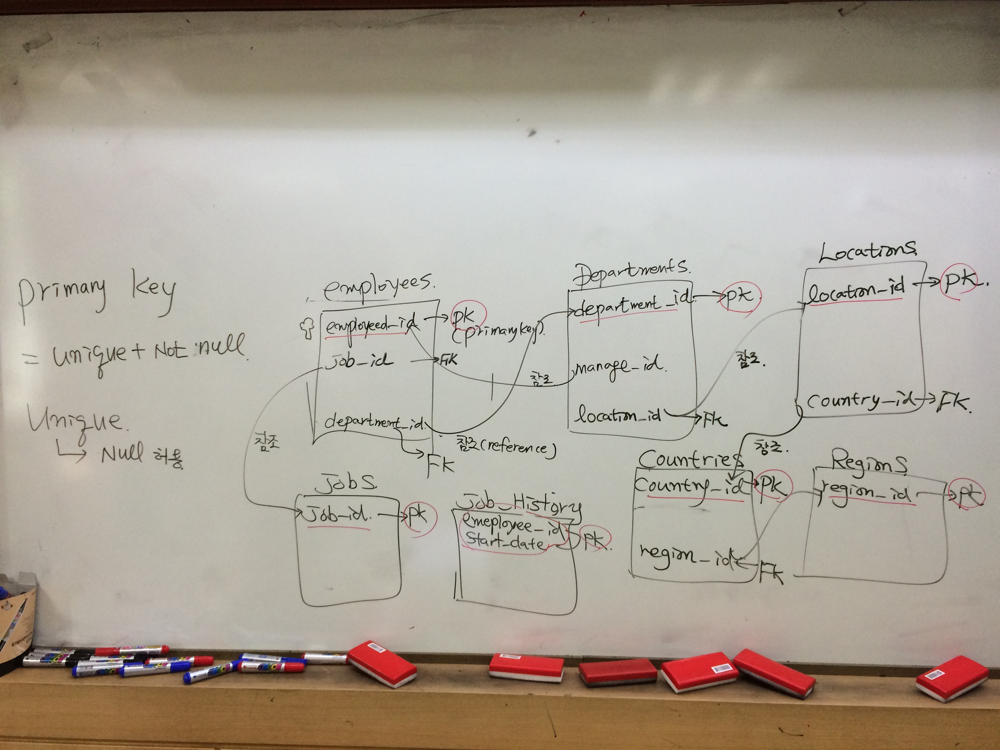

**[날짜 선택화면](../README.md)**

8.4 오전까지 Java완료

SQL : 8.4 오후 ~ 8.8 (2.5일)
Servlet / JSP : 8.9 ~ 8.18,8.19

SE프로젝트

##Iterator

Collection 예제

##Junit 추가

프로젝트 폴더 오른쪽버튼 -> build path -> configure build path -> add Library -> Junit 추가

##TestDatabase 클래스 추가

테스트전 @Before 어노테이션 사용

Junit을 왜 쓰냐? 작성한 것을 검증해야함.

.java 하나하나 검증
Broker.java는 UI
Database.java 검증없이 UI 붙이고 에러발생시 디버깅 시간이 오래걸림.
오류안난곳과 오류난곳의 범위를 좁혀줌.

## 변수이름 바꾸기

변수클릭 -> refactor -> rename -> 커서 나오면 입력하고 enter 

ssn name address
1번에 대한 ssn정보가 symbol이 있고 quantity

##SQL

employees 테이블의 employeed_id는 pk(primary key)
department_id는 foreign key 참조(reference)

테이블 분할이유

각각의 특징에 해당하는것을 갖기위해
필요없는 값 넣지 않게 하기 위해

##DB 객체 종류

- 테이블, 뷰, 인덱스, 시노님, 시퀀스, 함수는 값 반환, 프로시저, 패키지

##데이터 타입

- char 고정길이 문자
- varchar2 가변길이 문자

##날짜 데이터 타입

DATE
TIMESTAMP

##Unique, primary key
뭐가 다를까?
unique는 null 허용
pk는 null허용안함.

Unique는 null값 중복은 되지만 중복값은 허용안한다.
