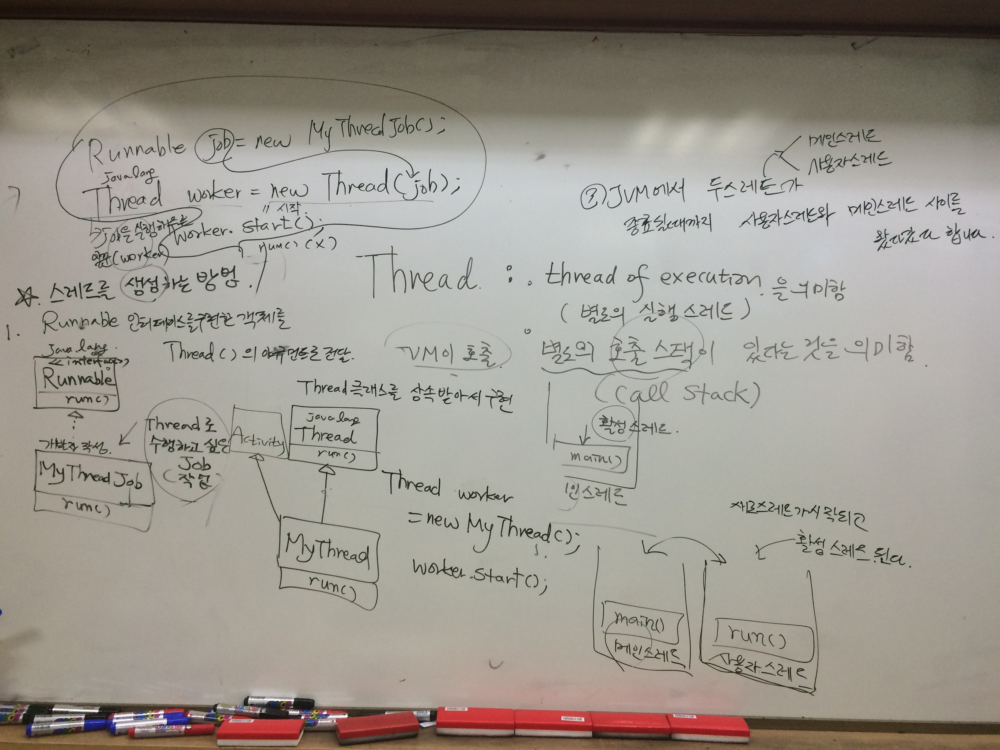
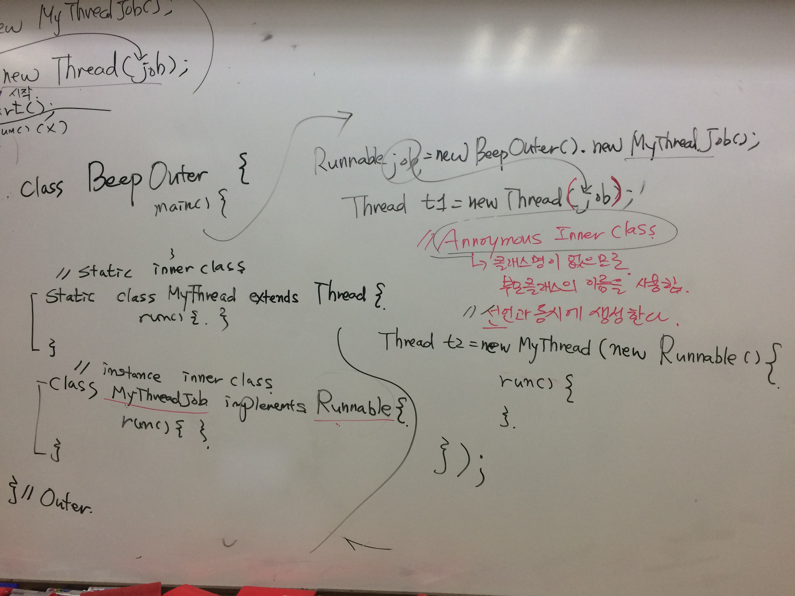
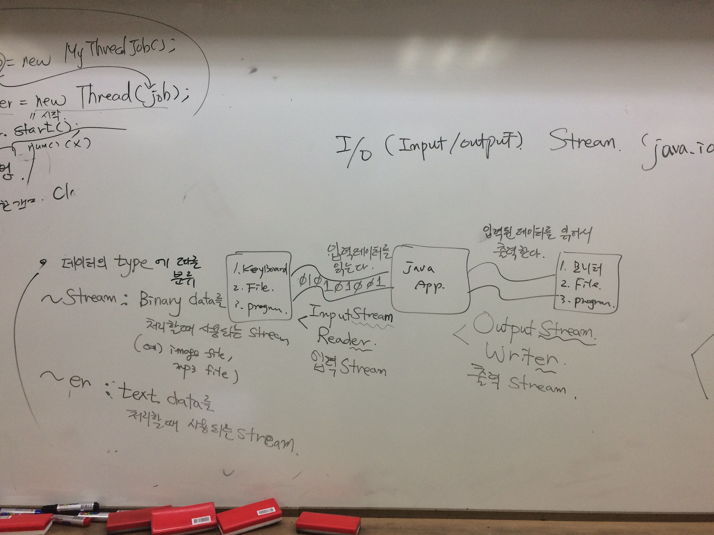
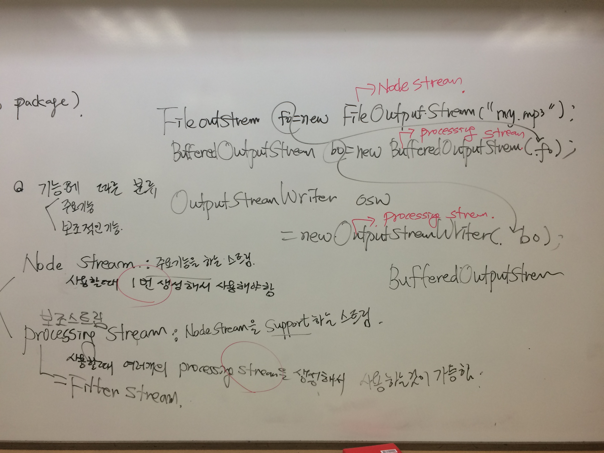

**[날짜 선택화면](../README.md)**

- Java Build Path 지정하기

  - 프로젝트 폴더 오른쪽 버튼 properties -> java build path -> edit -> C:\Program Files\Java\jdk1.8.0_91\jre\lib\ext\jfxrt.jar

##쓰레드

자바에 쓰레드는 언제 쓰는걸까? 

- 동시에 일을 수행하려할때 메인메서드 호출해주려고 하는데

- 메모리 어로케이션 해준다음 디어로케이션 따로안하는데 자바가 알아서 해주므로 개발자는 안해도 됨.

- 가비지 콜렉팅을 하는 스레드가 내부적으로 떠있는데 동시에 작업을 수행하는 게 필요하다면 쓰레드 생성하고 일을 시키면 됨.

  - Thread: thread of excution(별도의 실행스레드)를 의미함. 별도의 호출 스택이 있다는 것을 의미함(call stack)

  - 자바에서 main 호출

  - main(){} JVM이 메인쓰레드를 호출하는 것이다.

메인스레드는 활성화된 스레드가 되는 것이다.

main()에서 새로 스레드 시작

main(){}

스레드를 생성하는 방법

1. Runnable라는 인터페이스가 있다. run이라는 메서드가 제공됨. implements 시킴. thread로 수행하고 싶은 JOB(작업)
2. Runnable job = new MyThreadJob(); 

Thread worker = new Thread(job);

worker.start();

메인스레드(main()), 사용자스레드(run())

3. JVM에서 두스레드가 종료될때까지 사용자스레드와 메인스레드 사이를 왔다갔다 합니다.

  1. runnable 인터페이스 구현한 객체를 thread()의 아규먼트로 전달

  2. runnable안쓰고 바로 스레드 상속받음. -> 스레드 클래스를 상속받아 구현

ex)

Thread worker = new MyThread();
worker.start();

그럼 이 2가지 방법을 언제쓰는걸까?

Activity클래스가 있다. 이미 activity 상속받아 놓은 상태인데 스레드 또 상속받을수 없다. 이럴때

runnable 인터페이스 구현하고 구현한것을 스레드 인자로 넘겨주는 방식 쓰면 되는 첫번째 상속방식 사용

만약 스레드를 바로 상속 받을수 있다면 바로 2번째 스레드클래스에서 상속받아 쓰면된다.

상황에 맞게 쓰면 됨.

window -> show view -> navigator 

실습 BeepPrintExample1.java

##중첩클래스

1. inner클래스로 사용하기
2. static 클래스 사용하기

## 

Class BeepOuter{
static class MyThread extends Thread{} 
class MyThreadJob implements Runnable{}
}

Runnable job = new BeepOuter().newMyThreadJob();
Thread t1 = new Thread(job);
// annoymous Inner Class는 클래스명이 없으므로.. 부모클래스의 이름을 사용함
// 자기 이름 없으니 부모이름 씀.
// annoymous class는 선언과 동시에 생성하고 부모가 있는 클래스를 주로 사용함. 

Thread t2 = new MyThread(new Runnable(){
 run(){//런메소드 구현};
});

// 어노니클래스는 왜쓰지? 별도의 클래스 굉장히 많이 써야하는데 내부에서 잠깐쓰고 일회용 클래스라 생각하면 됨.

##IO(Input/Output) Stream (java.io package)

스트림을 통해서 데이터 흘려보냄
출력하면 읽어들이고 스트림의 특징 잘 이해해야함.

데이터는 출발지에서 도착지로 들어감. 출발지는 sync 도착지는 destination

- 입력스트림
  - 데이터 읽는 장치가 키보드, 파일, 프로그램 
  - 입력데이터를 읽어들이는 것.
  - InputStream과 Reader가 있다.

- 출력스트림
  - 읽은 데이터를 출력해야할때는 모니터, 파일, 프로그램
  - 입력 데이터 읽어서 출력한다. 
  - OutputStream을 쓰거나 Writer를 쓴다.

어떨떄 InputStream쓰고 어떨때 Reader 쓸까?

이미지 파일 읽어들일때는 InputStream, 텍스트 파일 읽어들일때는 클래스이름이 ER로 끝나느것을 사용하면 됨.

- ~Stream : Binary Data를 처리할때 사용하는 Stream 
Binary Data는 이미지파일, mp3파일.. 종류를 바이너리 타입이라함. 텍스트도 처리가능함.

- ~er : Text Data를 처리할때 사용하는 Stream, er은 텍스트전용임.

##보조 스트림
입출력하는데 있어서 처리하는 데이터가 바이너리데이터냐 텍스트데이터냐에 따라 구분되어지는데
기능에 따른 분류가 가능하다.

주요기능이냐? 보조기능이냐?에 따라 분류 가능
주요기능을 하는 스트림을 Node Stream 이라 하고 보조적인 기능을 하는 스트림을 Procesing Stream 이라 한다.
- Node Stream : 주요 기능을 하는 스트림, 사용할때 1번 생성해서 사용해야함.
- Processing Stream(=Filter stream) : Node Stream을 서포트하는 스트림, 사용할때 여러개의 processing stream 생성해서 사용하는것이 가능

ex) 
FileOutputStream
파일을 출력하는 스트림 파일을 뭔가 출력하려할때 계속적으로 네트워크로 보낼려할때 읽고 보내고 읽고 보내고가 빠르겟어?
버퍼링해서 다 모았다가 버퍼있는 데이터 보내는게 빠를까?

하나읽고 보내는것보다 쭉 읽어들인다음 버퍼에 있는것을 보내는것이 빠르다.
그럴때 어떤 스트림이 있냐면 BufferdInputStream이라는것이 있다. 물론 FileWriter도 있고 BufferdOutputStream도 있다.
FileOutPutStream은 파일을 출력하는게 주기능이므로 꼭 써야하지만, BufferedOutputStream을 안쓴다고해서 문제는 없다. 속도를 빠르게 하기위해
보조적으로 쓰는것이 버퍼기능을 사용함.

**노드스트림이냐 프로세스스트림이냐를 구분할줄 알아야함.**
노트스트림 횟수 제한있다.
노드스트림의 경우 한번만 쓸수 있지만. 프로세스스트림의 경우 자신이 원하는만큼 보조적인 기능이 여러개 있으므로 사용가능하다.

FileOutputStream fo = new FileOutputStream("my.mp3"); -> NodeStream
BufferdOutputStream bo = new BufferdOutputStream(fo); -> Processing Stream
OutputStream osw = new OutputStreamWriter(bo); -> Proccessing Stream

그러면 스트림의 종류 구분은 어떻게 할수 있을까?

생성자의 아규먼트 타입을 보면 노드스트림인지 프로세스스트림인지 알수 있다.

Node Stream과 Processing Stream을 구분할 수 있는 방법

1. 생성자의 type으로 판단함.
2. NodeStream의 생성자의 아규먼트에 resource의 정보(예: file명, file객체)

Processing Stream: 생성자의 아규먼트에는 NodeStream이 전달됨.
(Reader/Writer, InputStream/OutputStream)

##Node Stream만 써서 입출력 시간 계산해보고 Processing Stream 써서 입출력 시간 계산해서 얼마나 빠른지 확인해보겠다.

##InputStreamReader

InputStream is = System.in; // node stream

Reader reader = new InputStreamReader(is); // processing stream

##ObjectInputStream, ObjectOutputStream

객체를 읽고 쓸수있다.
코끼리를 냉장고에 넣는 얘기

ObjectInputStream / ObjectOutputStream

객체를 읽어드림
객체를 쓰는 것임

Object
ICE(얼음)  냉동실에 
큰 얼음을 냉동실에 넣으려면 부셔야함.
01010101 직렬화(serialization) 

직렬화 시켜서 냉장고에 넣어둔다.
직렬화 한 데이터를 쓰려면 objectoutputstream을 쓰는거고 읽어들이려면 objectinputstream을 쓴다.

objectinputstream에 readobject(), writeobject()

serializable이라는 인터페이스가 있는데 implements를 받아야함.

서로 객체를 주고받는 스트림이 objectinputoutstream이다. 

objectinputoutstream을 쓰려면 클래스에서 반드시 시리얼라이저블이라는 인터페이스를 implements 받아야한다.
