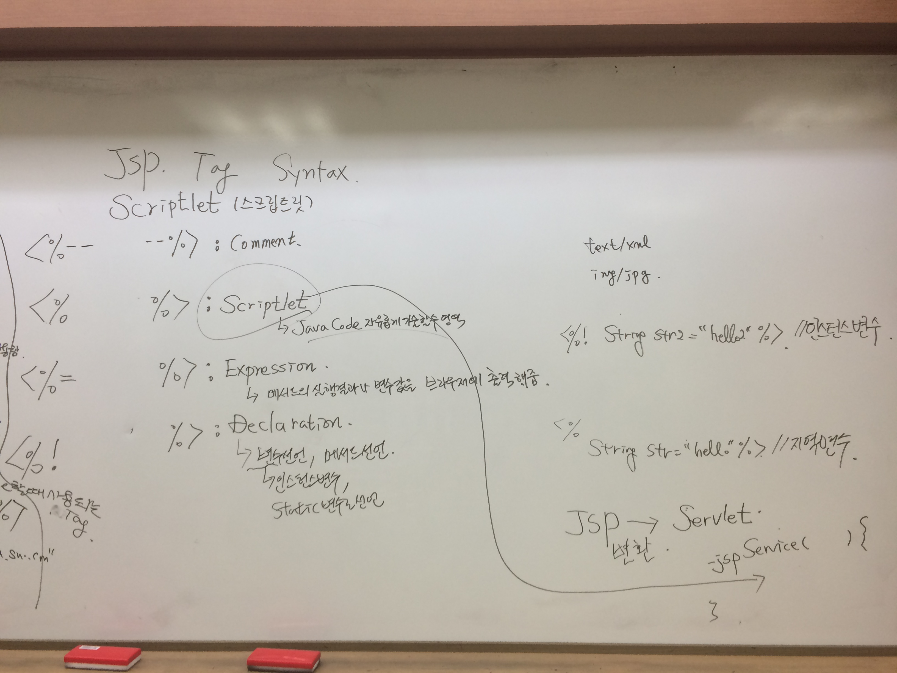
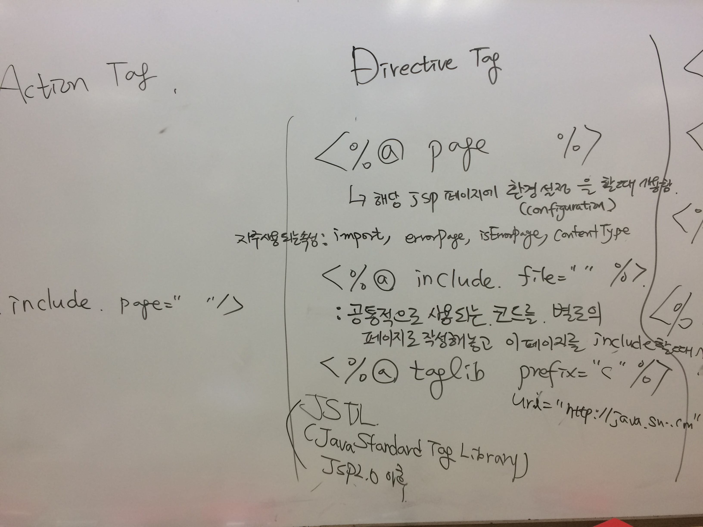

**[날짜 선택화면](../README.md)**

##서블릿 JSP

##java path 설정하기

- 내컴퓨터 속성 -> 고급설정 환경변수 -> 시스템변수 새로만들기 JAVA_HOME -> jdk 설치된 path 설정 C:\Program Files\Java\jre1.8.0_101 -> 확인

- tomcat에 conf 폴더 -> server.xml 에 포트번호 수정 8080 -> 8087

- startup.bat 파일 실행 server start up in 2856 ms

- http://localhost:8087 입력 -> 고양이 톰캣 웹페이지 나옴.

고양이 웹페이지는
C:\java\apache-tomcat-8.0.36\webapps\ROOT 폴더에 index.jsp 파일 나오는것.

##hello.jsp 작성하기

- <% %> 안에서 자바 코드를 마음대로 작성할수 있다.

- html태그안에서 <% %> 를 사용해 자바코드를 넣을수 있다.

##JSP Tag Syntax

- %로 쓰는것을 Scriptlet(스크립트릿) 이라함.

- <%-- --%> comment

- <% %> scriptlet 자유롭게 자바코드를 기술할수 있는 영역 표시

- <%= %> expression %랑 = 이랑 붙어서 써야함. 특정 메서드의 실행결과나 변수값을 브라우저에 출력하는 것.

- <%! %> declaration 선언하다. <% String str = "hello" %> <%! String str2 = "hello2" %> 둘다 변수는 선언했지만 저장되는 영역이 다름

클래스 바로 밑에 선언하는 변수를 전역변수(인스턴스변수) %!로 써서 선언하면 인스턴스변수로 선언된다.

**JSP -> servlet으로 변환 servlet.java로 변환해줌. **

C:\java\apache-tomcat-8.0.36\work\Catalina\localhost\ROOT\org\apache\jsp 에서 hello_jsp.java 파일을 확인할수 있음.

확인해보면 servlet 형식으로 코딩되어있음.

20라인 코딩 후 500 에러 코딩 -> 코딩 잘못한것. ex) 125번 라인 오류이면 변환된 .java파일 확인하면 됨.
 

JSP -> Servlet _jspService() 으로 들어감 -> 

- <%@ %> Directive Tag

  - <%@page %>, 해당 jsp 페이지에 환경설정(configuration)을 할때 사용함.

  - 자주 사용되는 속성: import, errorpage, isErrorpage, contentType

  - 해당되는 jsp파일 인코딩 pageEncoding characterset,

  - 응답결과 출력되는 인코딩이 contentype에서 characterSet이다.

- <%@include file="" %> 

  - 공통으로 계속 쓰는 로직을 불러다 쓰는것. 공통으로 만들어놓은것을 include하는것. 
  
  - 공통으로 사용되는 코드를 별도의 페이지에 만들어 작성해놓고 이 페이지를 include할때 사용되는 tag

- <%@taglib prefix="" %>

  - JSTL(JavaStandardTagLibrary) jsp 2.0 이후 버전부터 나오기 시작한 것. 자바코드 조금 줄여보자 라고 만든게 JSTL이다.
    - ArrayList, for문 테이블 만들려면 필요함. 개발자들이 자주사용하는 것을 태그로 만들어 제공해주는게 JSTL이다.
    - <%@taglib prefix="c" %> 

##Action Tag

- <jsp:include.page="" />