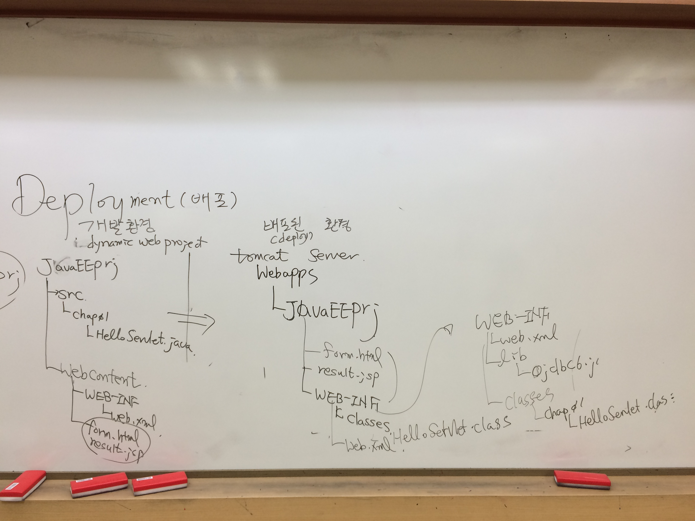

**[날짜 선택화면](../README.md)**

##URL과 웹페이지

- http://localhost:8090/J2EEPrj/hello.jsp?name=dooly
  - 프로토콜, 서버이름, 경로, 쿼리 문자열

- ?문자열 -> 쿼리 문자열

- 정적 자원 -> 이미지, 텍스트
- 동적 자원 -> 회원정보 보여주려면 jsp,asp,php 사용해야함

##폼 메소드 GET,POST

\<form method="GET"> 

- 서버상태가 변하지 않는게 get방식 사용
- get방식은 파라미터 값 길이 제한 있음.
- 쿼리 내용이 주소에 나타남.
- 게시판 글보기 

\<form method="POST">

- 데이터 입력해서 DB에 저장한다면 post방식 사용
- post방식은 파라미터 값 길이 제한 없음.
- 쿼리 내용이 주소에 사라짐.

자바스크립트를 사용해 체크박스 체크여부 알람 넣기 가능.

##J2EEPrj -> war(web Archive) export 하기

1. Tomcat(톰캣) 이용 server start
 
프로젝트 폴더 -> export -> war -> browse -> C:\java\apache-tomcat-8.0.36\webapps

-> export함 ->  start.bat 서버 실행 -> server스타트되면서 자동으로 압축풀어짐. 

http://localhost:8087/ 실행 C:\java\apache-tomcat-8.0.36\webapps\ROOT\index.jsp -> http://localhost:8087/JavaEEPrj/form.html 확인

## 서블릿 클래스 만들기

Java Resources -> src -> chap01 -> HelloServlet.java

tomcat Server Webapps - JavaEEPrj

- 웹페이지의 기능별로 하위 디렉토리 생성 구분하여 작업함.

