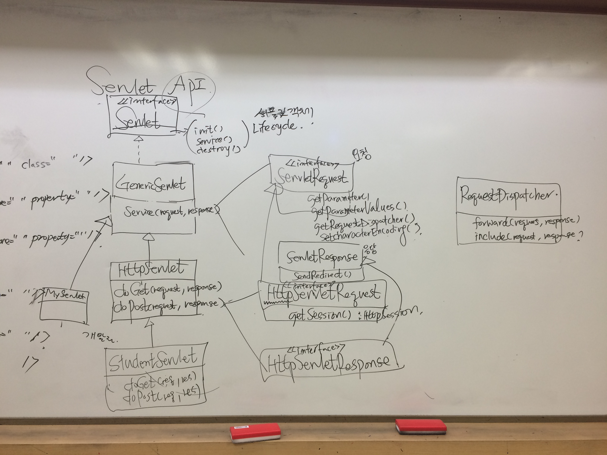
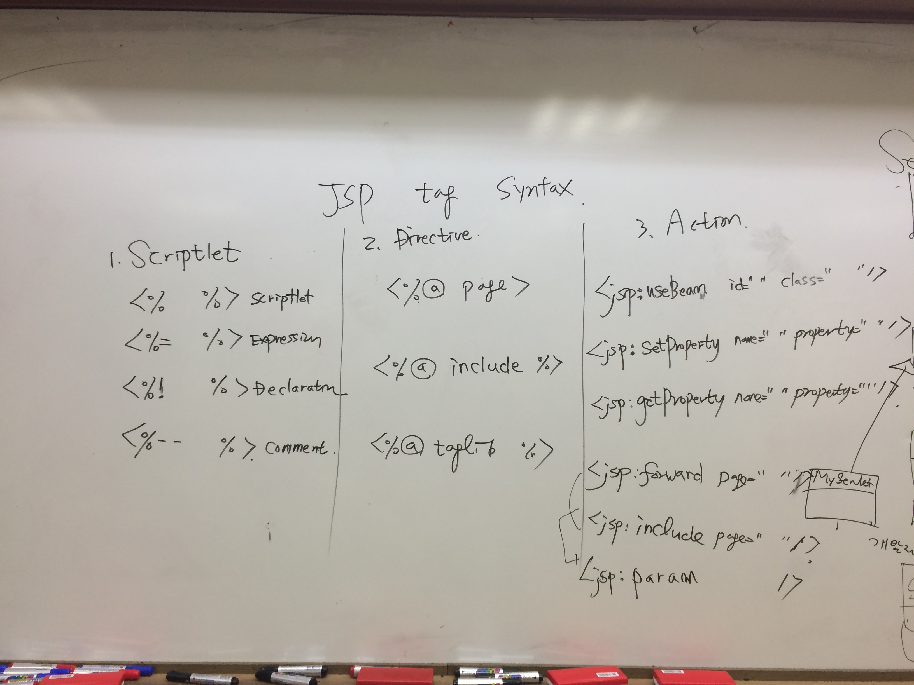
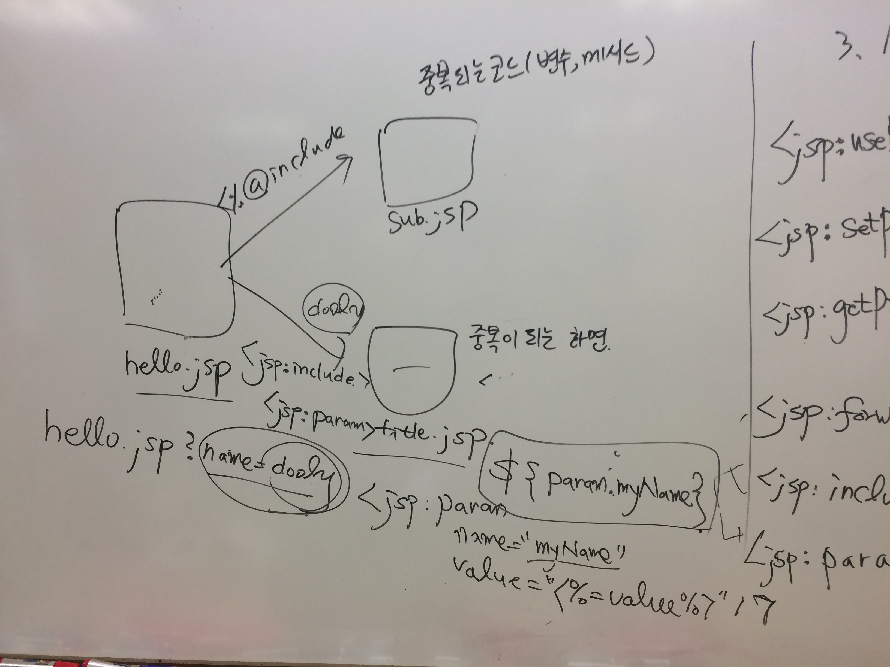
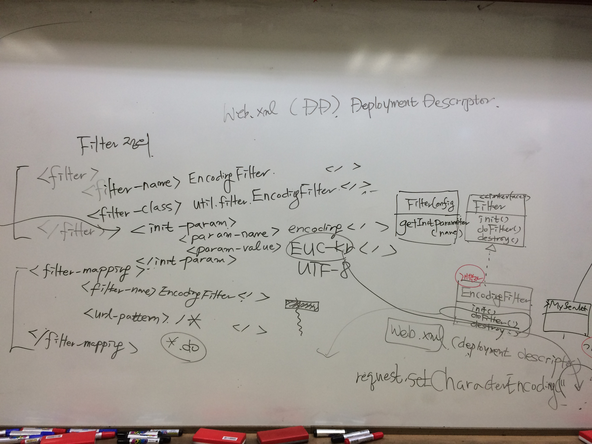

**[날짜 선택화면](../README.md)**

- 데이터 요청 차이

  - GET url append 방식으로 쿼리에 데이터 정보 보임. 서버 조회 요청

  - POST 크롬 브라우저 개발 툴에 stream 바디부분에 보낼 데이터 정보 실어져 감.  등록 수정 삭제 요청

- doGet, doPost

- http는 요청 응답 기반 

- 입력값 뽑아낼떄 getparameter(); getparameter(values);

- sendredirect() 특정 페이지로 가게하는 것.

- getSession() : http 세션객체를 만들어주는것.

## Servlet

LifeCycle
- init()
- service()
- destroy()

## GenericServlet
### service(request,response)

- ServletRequest 요청
  - getParameter()
  - getParameterValues()
  - getRequestDispatcher()
  - setCharacterEncoding()

- servletResponse 응답
- sendRedirect()

## HttpServlet
### doGet(request,response)
### dopPost(request,response)

- HttpServletRequest
  - getSession : HttpSession

- HttpServletResponse

--------------------------------------------

- RequestDispatcher
  - forward(request,response)
  - include(request,response)

##세션 종류

1. page scope : PageContext
2. request scope : ServletRequest
3. session scope : HttpSession
4. application scope : ServletContext
(setAttribute(key,value),getAttribute(key))

페이지 안에 서로 통신하는 것.
데이터를 주고 받고 하는 용도로 쓰는것.

- page scope: 페이지는 한 페이지 안에서만 쓰이는것. 자기자신만 씀. 잘 안쓰임.

- request scope: 리퀘스트는 여기서 여기 넘어갈때 쓰임. 이친구가 저친구한테 리퀘스트 보낼려면 징검다리처럼 리퀘스트 주는방식으로 가는것.

- session scope: 세션은 한번 생성되면 저 끝에도 볼수있음. 세션 유지할때만 브라우저가 세션임.

- application scope: 어플리케이션은 was, was가 스타트되어있으면 was가 사용하는 메모리가 남아있음. 
(서블릿컨텍스트 셋어트리뷰트로 넣어놓으면 계속 남아있다. was가 켜져있는동안 볼수있음.)

##JSP Tag Syntax

1. Scriptlet 

  - \<% %> 자바코드 자유롭게 기술

  - \<%= %> expression 메소드나 변수 출력

  - \<%! %> declation 선언

  - \<%-- %> 주석

2. Directive

  - \<%@ page>

  - \<%@ include %> %붙은 include는 메인이 있고 서브 jsp서블릿으로 변환 완전히 포함시키면서 서블릿 덩어리로 만들어버림. 
코드레벨에서 합쳐버리는것. 공통으로 들어가야하는 코드 %include 씀.

  - \<%@ taglib %> jstl 태그라이브러리 쓰려고 할때 사용

3. Action

  - \<jsp:useBean id="" class=""/> vo 객체를 javabean이라 핞다. javabean을 사용하는 태그
리퀘스트 객체에 저장되어있는 객체에 꺼내는것을 함.

  - \<jsp:setProperty id="" property=""/> setter메소드 호출

  - \<jsp:getProperty name="" property=""/> getter메소드 호출

  - \<jsp:forward page=""/> result.jsp로 리퀘스트객체 전달하는 것.

  - \<jsp:include page=""/> 페이지 각각 만들고 runtime실행시킬때 화면 레벨에서   합쳐지는 것.

  - \<jsp:param />

## \<%@ include %>와 <jsp:include page=""/> 다른점

dooly라는 값이 리퀘스트객체로 담겨서 가져감.

## setCharEncoding 한번만 설정하고 다음번 설정 안하려면? 필터 사용함.

EncodingFilter
init()
dofilter()
distory()

<filter-mapping>
  <Filter-name></>

인코딩은 내부적으로 작성하면 가변적이여서 소스고치는 작업 불편하고 위험
필터를 사용해서 소스안에 인코딩소스를 넣지 않고 빼서 분리작업함.

<%  %>

## 프로젝트 만들기

1. Dynamic web project 생성

2. 입력화면 xx.html 작성

3. xxVO.java 작성 filter복사 web.xml복사, jstl.jar 복사

4. xxServlet.java 작성

5. result.jsp , special.jsp  페이지 작성

6, 7, 9, 19 책 읽어보기

