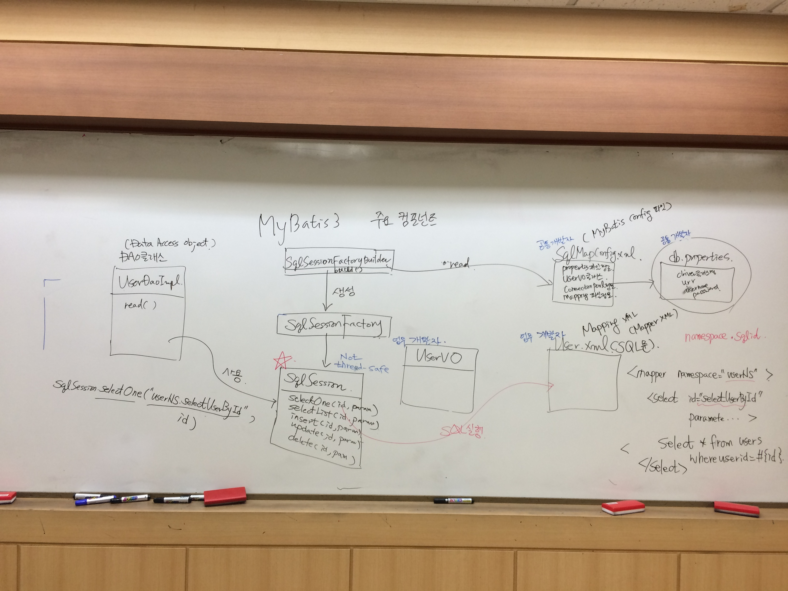
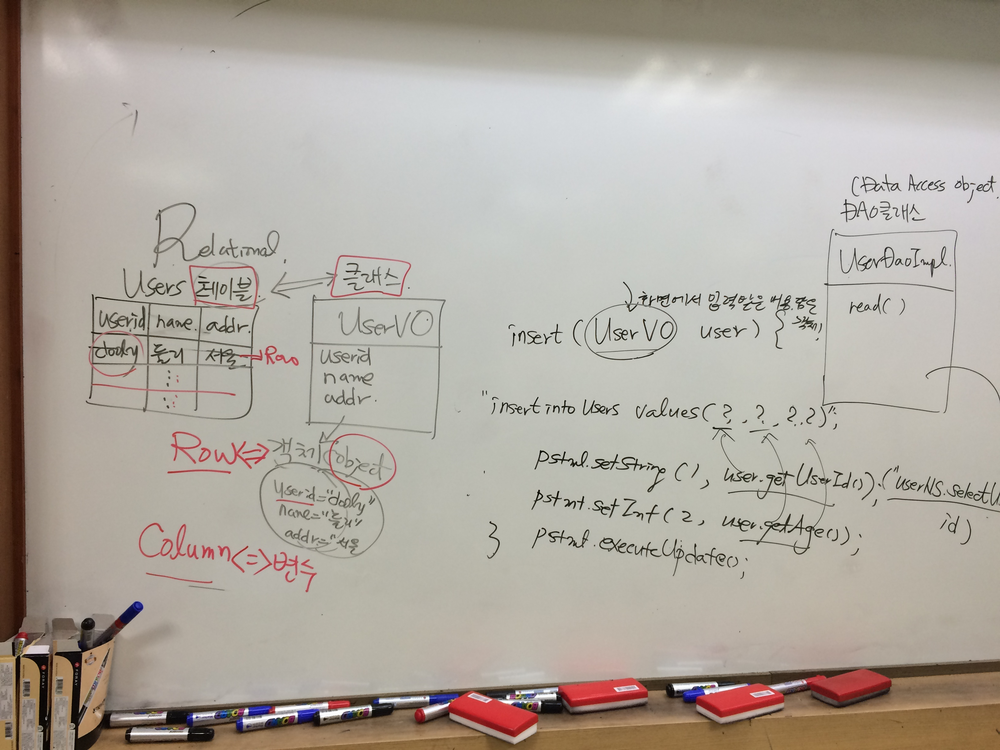

**[날짜 선택화면](../README.md)**

##메이븐

- 메이븐은 빌드툴이다.
- 메이븐은 디렉토리 옮기고 필요없는 파일 지우고 압축하는 작업 과정 해주는 도구 빌드툴이다.
- 기존의 라이브러리 방식은 라이브러리를 다운로드해서 압축풀어 프로젝트에 라이브러리 복사하고 클래스패스 추가하는 방식
- Maven에서 의존성 라이브러리 관리는 porm.xml 파일을 수정한다 -> 빌드한다를 순환하며 반복한다.

##메이븐 저장소 만들기

- window -> show view -> other -> maven repositories 만들고

- 프로젝트 폴더 잡고 -> 마우스 오른쪽 버튼 configure -> convert maven -> pom.xml 열어본다.

##메이븐 저장소

- 메이븐 저장소에서 mybatis와 oracle ojdbc6를 검색해서 maven dependecy소스를 복사한다.

- Oracle JDBC Driver For Java Oracle.jdbc.driver.OracleDriver Ojdbc6 소스 복사

  - http://mvnrepository.com/ 들어가서 mybatis 검색

  - http://mvnrepository.com/artifact/org.mybatis/mybatis/3.4.1 Maven 소스 복사

  - http://mvnrepository.com/artifact/com.hynnet/oracle-driver-ojdbc6/12.1.0.1

  - pom.xml에 dependency 붙여넣기

넣어주면 이클립스에서 jar파일 가져옴.

메이븐 말고도 Gradle 등 다양한 빌드툴 있다.

##MyBatis3 주요 컴포넌트

xml이 여러개 있다.

SqlMapConfigure.xml(Mybatis Config 확인)
properties 확인 경로
userVO클래스

db.properties

user.xml(SQL문)
Mapping 파일(Mapper xml)

클래스명
url
password

db.properties 자주변경되는 정보는 별도의 파일로 빼내서 만든것.
MybatisConfig.java

sqlsession이 user.xml에 sql실행해주는 역할이다.

- SqlSessionFactoryBuilder
  - build()

- SQLSessionFactory 자바 객체 만들어주는 공장역할

NOT thread.safe

- SQLSession()

  - selectOne(id,param)

  - selectList(id,param)

  - insert(id,param)

  - update(id,param)

  - delete(id,param)

- UserDaoInput DAO(Data Access Object)클래스
  
  - sqlSession selectOne("userNS.selectUserById",id)

## 다시 설명

- MyBatis ORM(Object Relational Mapper)

맵은 지도 매핑은 두개를 짝짓기해준다. 사상 연결해준다.
자바객체랑 rdb테이블이랑 연결해준다.

레코드 하나 읽어서 where조건절에 컬럼 여러개 나오는데 한 row읽으면 vo객체에 담지 그게 맵핑이다.
테이블을 그려보면
rdb테이블이 있다.

users테이블
userid | name | address
dooly | 둘리 | 서울

userVO라는 클래스있다.

userid
name
addr

클래스가 있고 클래스가 테이블하고 매핑됨.
클래스에서 javaObject 만들어짐
객체 만들어지면 userid="dooly1" name="dooly"들어감 특정값이 들어감. object

users테이블에 1row랑 자바객체랑 맵핑된다.

컬럼은 뭐랑 매칭되지? 컬럼의 데이터는 자바객체의 변수와 맵핑된다.

테이블은 클래스 클래스로 부터 여러개의 객체를 row와 object

만약 jdbc를 썻으면 일일히 하나하나 맵핑해야했음.

while(rs.next()){
 user = new userVO(rs.getString("user"),rs.getString("name")
 list.add(user); 
}

위 과정 안해도된다.

result type에 uservo라고 써주면 다 저장해준다.
list객체에 알아서 해줌.

Insert는 어떻게 하나?

화면에서 입력받은 내용 닮고 있는 객체 VO 들어오면
insert(userVO user){

insertintoUsers values(?,?,?,?);
pstmt.setString(1,user.getUserId,id)
setInt(2,user.getAge());
pstmt.excuteUpdate();
}

맵핑하는 작업을 일일히 했다.

그런데 안해도됨.

Insert 쿼리를 보면 파라미터 타입에 user라고 되어있음.

uservo 지칭해주면 user.get메소드 호출해서 맵핑하는 작업 다해준다.

---------------------------------------------------------------------

읽어서 vo객체 담아주고 vo객체 담아주면 insert해주고

row를 객체에 맵핑해주고 column을 변수와 맵핑해주고

mybatis를 orm이라고 한다. 맵핑하는 작업을 계속해주니깐.

항상 반복되니깐 jdbc쓰니깐 매번 똑같은 일을 반복적으로 하더라

너네는 쿼리쓰고 vo클래스 객체만 알려줘 내가 맵핑해줄게 이게 mybatis이다.

ibatis에서 mybatis로 이름이 바뀐것.

----------------------------------------------------------------------

속도가 느리다는 튜닝필요 요청 생김.

소스안에 sql 따로 빼면 역할을 나눠 분리할수있다.

--------------------------------------------------------------------

PM은 쪼기만 함
PL 업무 중간관리자
PMO 엑셀 워드 문서작성

as is 있는 그대로
to be 신규로 개발해야할 것.

----------------------------------------------------

------------------------------------------------------

MyBatisPrj -> src -> mybatis.config, mybatis.util을 javaEEPrj src 폴더안 패키지에 복사함.
