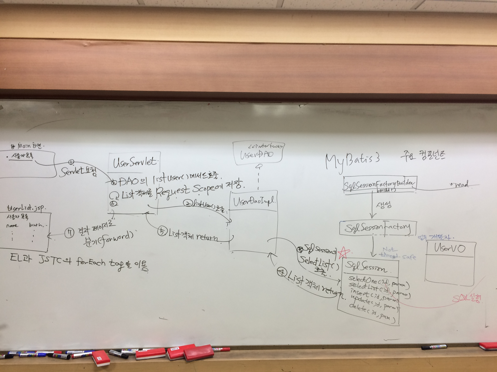

**[날짜 선택화면](../README.md)**

##MVC(Model / View / Controller)



Seperation of Concerns

:one: Model1 아키텍처 

- Model - java
- Controller - jsp
- View - jsp/html

jsp안에서 <%%> 많아짐. jsp안에다 자바코드 많이 넣어서 코딩함.

:two: Model2 아키텍처 

- Model - java
- Controller - Servlet
-  View - jsp/html

Controller를 Servlet을 썼다.

웹어플리케이션 프레임워크 있다. 

웹 어플리케이션 프레임워크는 모델2 아키텍처를 기반으로 하고 있다.


##서블릿 라이프 사이클


dao 객체가 doPost doGet 할때마다 계속 만들어지면 메모리 낭비 심해짐.

서블릿 객체가 생성되는 시점에 한번 생성되게 해라.

Servlet 클래스

:one: init() - servlet객체 생성후에 1번 호출되는 메서드

:two: service() - doGet / doPost() 메서드 사용자가 요청을 보낼때마다 호출되는 메서드

:three: destory() - servlet객체 gc(가비지 콜렉팅)되기 전에 호출되는 메서드

GenericServlet

HttpServlet

UserServlet - init() DAO객체생성, doGet / doPost() 메소드 생성

JSTL
http://mvnrepository.com/artifact/javax.servlet/jstl/1.2

서블릿 하나 만들어서
사용자목록 나온것을 이 아이디에 링크를 걸어두고 링크를 클릭하면 usercontroller2라고 만들어서 컨트롤러 부름

컨트롤러가 dao에 id주면 갖고오는 메서드 

get방식으로 ? 로 줘
get방식으로 해당되는 userId로 줘
컨트롤러 부를때

````java
<a href="controller=? userid=${user.userId}">

servlet에서는 request.getParameter(userId);
````

한개한개 받아오면 힘들어서 하나로 만드는것을 해보자

## POST방식 분기로직 방식 프로젝트 생성하기


분기로직

````java
String cmd=request.getParameter=("cmd")
if(cmd.equals("list"){
    
}else if(cmd.equals("one"){
    
})
````

