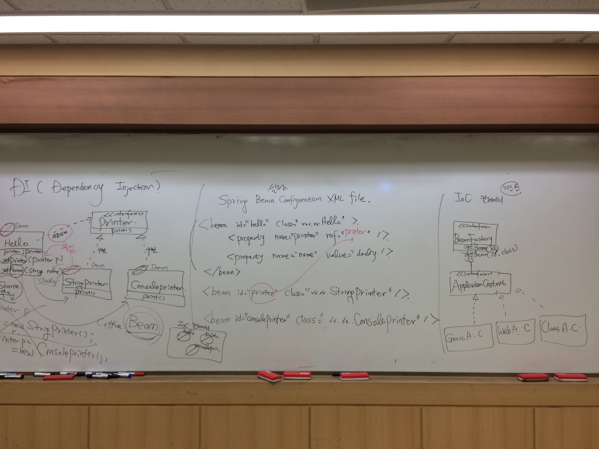
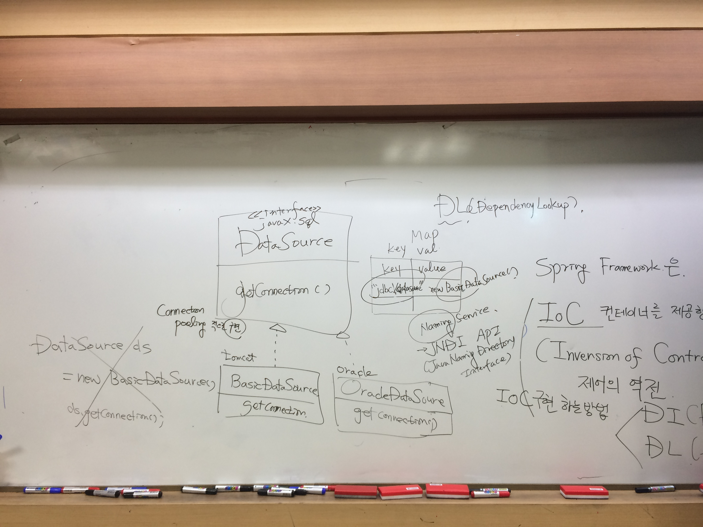
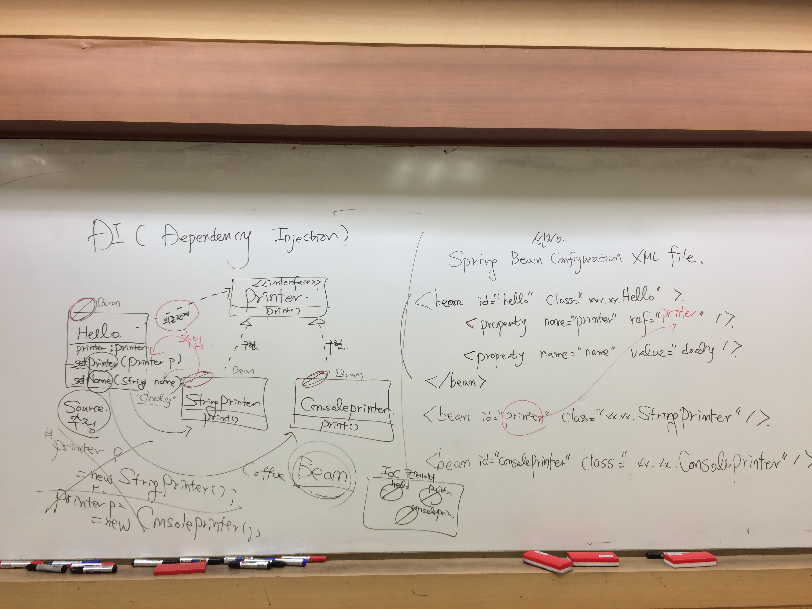
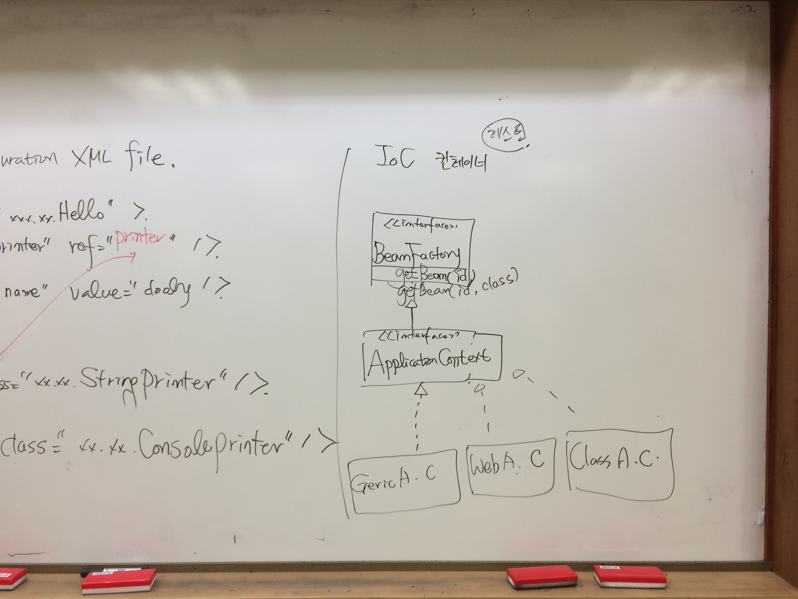

**[날짜 선택화면](../README.md)**

##Spring tool 설치

1. help -> eclipse market place -> sts 검색 -> spring tool suite(sts) for eclipse 3.8.1 REALEASE 설치

2. 구글 sts download 검색 

##전자정부프레임워크

eGovFrame 프레임워크인데 내부는 다 spring, maven이다.

##이클립스에서 Spring 설치하기 

http://mvnrepository.com/ 에서 spring 검색 ->
Spring Context » 3.2.17.RELEASE에 Maven 복사
http://www.mvnrepository.com/artifact/org.springframework/spring-context/3.2.17.RELEASE

pom.xml 에 추가하고 프로젝트 폴더 잡고 오른쪽 버튼
Maven -> Update Project -> Force Update of Snapshots/Releases 체크 하면 오류 사라짐.

##Spring Framework

배워야 할 필수적인 것.

1. DI (Dependency Injection)
2. AOP(Aspect Oriented programming)
3. Spring MVC
4. MyBatis-Spring Integration(연동)

##Servlet이랑 자바클래스랑 차이점이 뭘까?
서블릿 쓰기전에 standard edtion 쓴경우 customer 클래스 만들었어 커스터머 쓸려면 new쓰고 객체 가져와서 사용했음.
doGet doPost는 탐캣(was) 이 함. 웹컨테이너 역할을 하는 탐캣이 함.
객체 생성하고 특정 메서드 호출해주고 was가 해준것임.

스프링도 그런 역할을 함.
자바클래스 만들어놓으면 스프링프레임워크에 해줌.

##라이브러리와 프레임워크 차이

주도권을 누가 쥐느냐... 자바API가 있다. 호출하는 책임은 라이브러리한테 있다.
프레임워크는 라이브러리적인 요소도 가지고 있지만 라이브러리와 다른점은 
Junit은 프레임워크이다. 테스트케이스 만들고 객체생성 안하고 어노테이션만 붙이면 다해줬으므로
즉 개발자가 규칙을 지켜서 클래스 만들어놓으면 
컨테이너적인 것은 프레임워크 

 라이브러리는 책임이 개발자에게 있다.

라이브러리는 개발자가 객체를 생성하고 그 객체에 메서드를 호출한다.
주도권은 개발자가 가지고 있다.

Library는 개발자가 객체를 생성하고 그 객체의 메서드 호출 - 주도권: 개발자
Framework는 Library 적인 요소를 포함하고 있음. 개발자가 작성한 클래스를 framework이 객체를 생성해주고 그 객체의 메서드를 호출해준다. - 주도권 : framework

Spring Framework는 IoC(Invension of Control) 컨테이너를 제공한다. - 제어의 역전



IoC구현하는 방법이 DI, DL이 있다.
DI는 Dependency Injection 의존관계 주입(투입)
DL은 Dependency Lookup 의존관계 검색

\<\<interface>>
javax.sql 
DataSource |
-----------------|
getConnection()

Connection pooling적으로 구현 인터페이스이다.
데이터소스라는 인터페이스 구현은 dbms벤더 or was가 해줄수 있다.
구현한 클래스중에 BasicDataSource가 있다.

tomcat
BasicDataSource|
-----------------------|
getConnection()

oracle
OracleDataSource|
-------------------------|
getConnection()

DataSource ds = new BasicDataSource()
특정벤더에 종속되게 소스안에 박아쓰게됨
Tomcat



DL은 해당되는 Map key,value
jdbc\/datasource new BasicDataSource

JNDI API(JavaNaming Directory Interface)
써서 네이밍 서비스에 등록된 구현객체를 리턴해주는것이 DL이다.

하위 객체 생성해서 네이밍서비스에 등록해주는것을 개발자가 함.
Dependency lookup

datasource jndi

http://kenu.github.io/tomcat70/docs/jndi-datasource-examples-howto.html

특정 종속되지 않게 소스안에 박지않고 사용하기 위한것이 DL
환경설정이 was종류에 따라 다름.

DL보다 DI를 주로 씀.

벤더 종류가 바껴서 소스를 고쳐서 테스트하고 컴파일 해서 넘긴다는 것은 문제 발생함.

가변적으로 벤더에 종속이 되는 것은 소스안에 박지 않는다.

소스안에 박지 않게 하기 위해 한 노력이 DI, DL이 있다

둘다 lookup하는데 DL은 xml 파일 설정하는데 was vender에 종속된다는것이 단점이다.
tomcat은 server.xml인데 test서버로 갔는데 웹로직서버여서 설정이 다름.
소스는 재사용하는데 웹로직서버 설정을 또해야한다. 이게 dl의 안좋은 점이다.

DL은 was가 바뀌면 종속적



DI는 spring 설정파일에 한번만 해준다. was설정파일이 아니므로 탐캣을 쓰건 웹로직을 쓰건 웹 스피어를 쓰건 spring 설정파일 하나로 was에 종속되지 않게 커버가 가능하다.
springbin.config 파일 


DI에서 설정 어떻게 하는지 알아보자.
DI(Dependency Injection) 의존관계 주입

Hello예제 

Hello 

\<<interface>>
Printer
print()

StringPrinter
print() - 구현

ConsolePrinter
print() - 구현

메서드를 수정하면 AOP 에서

스프링 프레임워크가 객체를 생성해주는 것을 Bean이라고 한다.

new hello 하지 않고 bean으로 등록해주면 ioc 컨테이너에게 getbean한다.
의존설정은 spring bean configuration xml file

coffeeBean으로 등록한게 3개
Spring Bean Configuration XML file
````java
<bean id="hello" class="xxx.xx.Hello">
    <property name="printer"  ref="stringPrinter"/> <!-- set 빼준것.-->
    <property name="name"  ref="dooly"/> <!-- set 빼준것.-->

</bean> 
<bean id="stringPrinter" class="xx.xx.StringPrinter"/>
<bean id="consolePrinter" class="xx.xx.ConsolePrinter"/>
````

Hello|
-------|
printer:printer|
setPrinter(printer p)|
setName(String name)|

스트링프린터 객체 생성해서 setPrinter(printer p)에  주입시켜준다.

Hello 클래스는 상위 인터페이스 상위 클래스하고만 커뮤니케이션한다.

설정 다하고 나면 IoC 컨테이너에게 요청해야한다.



IoC 컨테이너

\<\<interface>>|
---------------------|
BeanFactory|
getBean("id")|
getBean("id.class")|
↑
application 
↑
GenericApplicationContext, WebAC, 

getBean - 생성된 bean을 가져옴.

DI의 목적은 클래스간 의존관계가 있을때 의존하는것을 클래스안에 언급하지 않는다. 의존하고 안하고를 설정파일에 한다.
설정이 많아지게 되서 annotation이 나오게 됨.

spring -> springConfigurationBean -> beans.xml -> beans체크 -> beans-3.2.xsd 체크

xml 스키마 확장자가 xsd이다.

xml쓰면서 버전관리하다보니 개발자끼리 문제 발생
-> 소스안에다 @ 어노테이션 정의해서 설정을 적게한다.

컴포넌트 어노테이션  -> Annotation을 사용한 DI 

##Bean등록을 위한 Annotation(spring 2.5ver이후) 

1. @Component
2. @Repository
3. @Service
4. @Controller

##Bean 사이의 의존관계(dependency)를 위한 Annotation 있다.

1. @Autowired
2. @Resource

개발하는 타이밍에 xml 공유하는 귀찮은점 발생
클래스 선언하면서 어노테이션 붙여서 만듬.

그러면 어노테이션보고 아 얘가 빈이구나 라고 알게됨.

````java
@Component // bean 이구나
public class Hello{
    @Autowird // 프린터 클래스를 의존하는구나
    @Qualifier("StringPrinter")
    Printer printer;

    @Value("dooly")
    String name;
}
````

stringprinter 
consoleprinter

````java

@Component("StringPrinter")
public class StringPrinter{
    
}

````

````java
@Component("ConsolePrinter")
public class ConsolePrinter{
    
}

````
````xml

<context:Component-scan.package="myspring.di.annet"/>

컴포넌트 스캔이란것이 있음.
패키지에 어노테이션 붙여놨으니 
니가 스캔해서 빈들 등록해라가 컴포넌트 스캔임.

````

