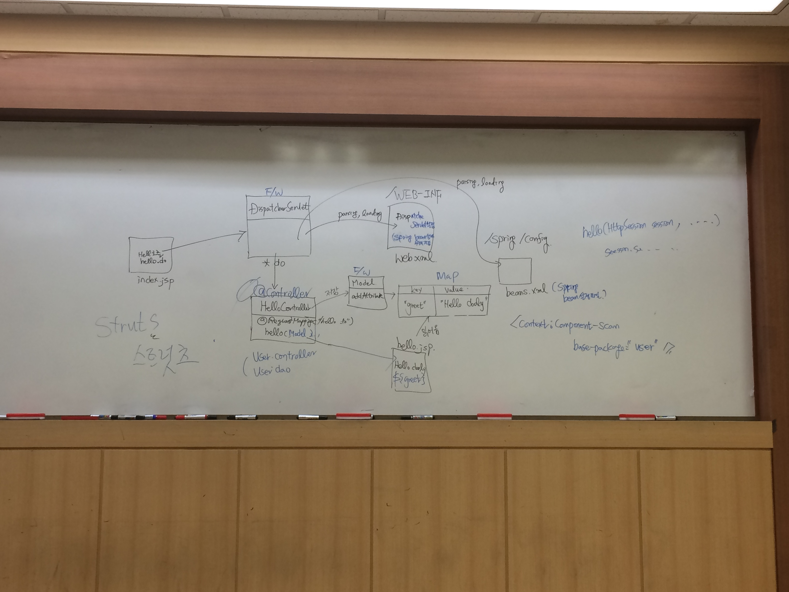
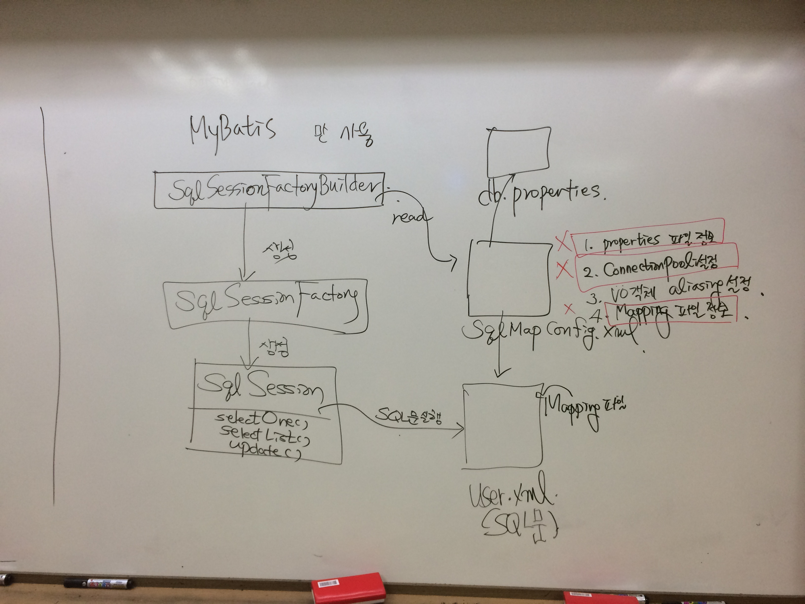
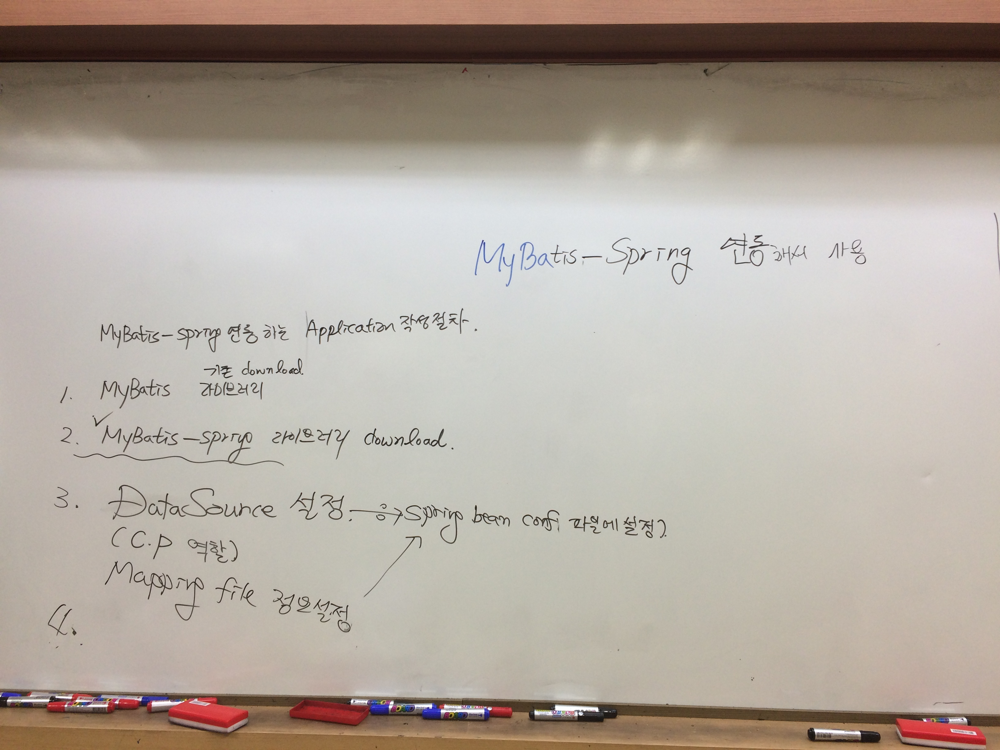
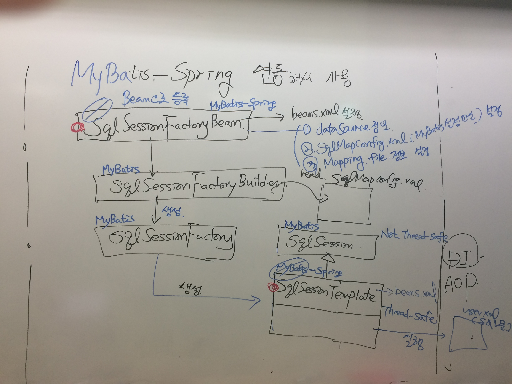

**[날짜 선택화면](../README.md)**

##SpringMVC : Controller역할을 하는 Servlet 제공함.

DI, AOP 등 일반적인 자바의 POJO형태로 만들었다.
web.xml에 설정

1. DispatcherServlet(web.xml)에 설정

2. Controller역할을 하는 POJO형태의 Java Class작성
    - @Controller 어노테이션 사용
        + Controller 클래스 안에 각각의 요청(request)를 처리하는 메서드 정의
            * request 밑에 @RequestMapping("") 맵핑 되는 커맨드를 정의하면 된다.
    - @RequestParam requestgetparameter해줌.
    - @ModelAttribute 화면 인풋태그 네임과 유저VO의 변수명과 맞아야함.

##Spring MVC 어플리케이션 작성방법

:one: Spring MVC 라이브러리 다운

:two: web.xml에 DispatcherServlet 설정

 -> web.xml에서 ctrl+spacebar #dispatcherservlet 찾기 넣기
 -> web.xml에서 ctrl+spacebar ContextLoaderListener 찾기 넣기

기존에 작성된 spring bean configuration 파일 위치 설정

:three: @controller 어노테이션을 사용하는 Controller 클래스 작성


##Web.xml

````xml
<servlet-mapping>
    <servlet-name>springDispatcherServlet</servlet-name>
    <url-pattern>*.do</url-pattern>
</servlet-mapping>
````
*.do 오면 dispathcer 서블릿 기동되게 하겠다.

````xml
<listener>
    <listener-class>org.springframework.web.context.ContextLoaderListener</listener-class>
</listener>
````

파일 위치(location) 알려주면 폴더가서 xml파일 있는지 찾아내서 파싱한다. 설정된대로 처리함.
웹 컨테이너가 스타트하면 contextlistner 작동함. 그 위치에 가서 xml 파일 파싱하고 거기 있는대로 빈을 등록하고 그럼.

````xml
<context-param>
    <param-name>contextConfigLocation</param-name>
    <param-value>location</param-value>
</context-param>
````

location 자리에 해당 파일명을 정해주면 된다.

````xml
  <filter>
    <filter-name>EncodingFilter</filter-name>
    <filter-class>org.springframework.web.filter.CharacterEncodingFilter</filter-class>
    <init-param>
      <param-name>encoding</param-name>
      <param-value>EUC-KR</param-value>
    </init-param>
  </filter>
  <filter-mapping>
    <filter-name>EncodingFilter</filter-name>
    <url-pattern>*.do</url-pattern>
  </filter-mapping>
````

request.setAttribute 는 Model 인터페이스와 같다.
Model은 request랑 같다.


web.xml - 1 서버가 열리면 바로 시작 맵핑하면서 모든게 등록

beans.xml  - 2 이게 등록됨 web.xml에서 등록됨.

index.jsp - 3 시작하면 controller로 가고

HelloController.java - 4 시작하면

hello.jsp - 5 마지막

-------------------------------------------------------

전체적인 설명



----

spring framework - struts

스프링MVC - 리퀘스트와 메서드가 맵핑되도록 해줌.

DAO부르는 user

--------------






##mybatis와 스프링을 연동해서 사용

MyBatis - Spring 연동하는 Application 작성절차

1. MyBatis 기존 download 라이브러리

2. MyBatis-Spring 라이브러리 download

3. Spring DataSource 설정(CP:ConnectionPool 역할) : Spring bean conf(파일에 설정)

4. Mapping 파일 정보 설정은 Spring been conf 파일에 설정한다.

##지금 까지 한것 중간 정리

- Java-oop개념
- SQL 연습(join, subquery, group by) orange tool 써봄, 
- JDBC 함.
- DataBase 연동해서 어플리케이션 레벨에서 조작하려고 JDBC씀.
- JDBC가 똑같은 것을 반복하는 작업 많아서 low-level이어서 실무에서 안쓴다.
- 증권 사고팔고 해보는것 해봄
- Servlet/JSP 해봄. 웹어플리케이션 사용해볼려고 해봄. <%%> jsp태그 공부, session scope, request scope
- jsp를 더 간단하게 만들기 위해 el, jstl 해봄.
- JDBC, MyBatis 공부함.
- Servlet에 MyBatis 연결해봄.
- Spring을 배움
- MyBatis랑 Spring 왜 연동하냐?
- Servlet이 SpringMVC로 바뀐것.
- SpringMVC에서는 MyBatis를 바로 부를수 없기 때문에 MyBatis와 Spring을 연동하는 라이브러리를 써서 Spring에서 만든 Controller와 Mybatis를 연결했던 DAO를 연결함. 
- MyBatis-Spring을 써서 Spring이 MyBatis-Spring을 부르고 MyBatis-Spring은 MyBatis를 부르는 것.
- DI 가 Basic 이고 그걸 확장 한 고급개념인 AOP, SpringMVC, MyBatis-Spring, Log4j 봄.


Mybatis Spring » 1.2.5
http://mvnrepository.com/artifact/org.mybatis/mybatis-spring/1.2.5

commons dbcp(data base connection pool)

-----------------------------------------------------------------

1. TestUserBean.java 생성
2. beans.xml datasource
3. db.properties


---------------------------------------------------------



SqlSessionFactoryBean

SqlSessionFactoryBuilder

SqlSessionFactory

SqlSession - 기존 MyBatis에서 제공함.

SqlSessionTemplate - MyBatis-Spring에서 제공


##Spring JDBC
http://mvnrepository.com/artifact/org.springframework/spring-jdbc/3.2.17.RELEASE

##복습

beans.xml에서 classpath랑 bean등록하는것. List안에 url 맵핑시키는것.

BasicDataSource에 필요한 것

클래스네임,  

p:driver

p는 태그 driverclass는 세터이다. 세터네임이 driverClassName이 있다.

p태그를 안쓰면 일일히 property name으로 주는것이다.

드라이버 url name 패스워드 최대 최소 라는 것은.

bean이라는 것은 String a= new String(); 이다.


SqlSessionFactory, 

String a = new String(new String("hello"));

객체를 넣어 만들수 있다. 

String a = new String("a");


1. spring web mvc, Spring JDBC, junit, Spring Context, commons dbcp, jstl, maven 다운
2. EmpwebVO.java , db.properties, spring 파일로 beans.xml 생성
3. 